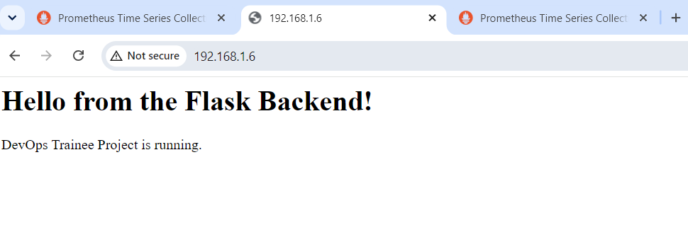
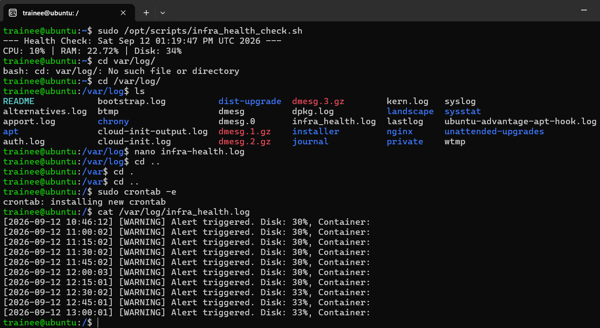
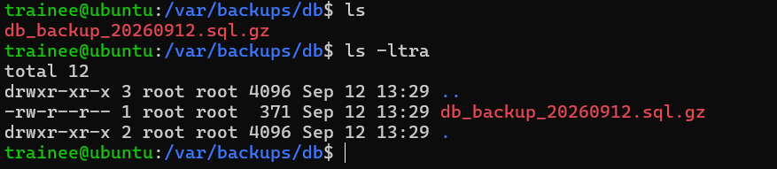
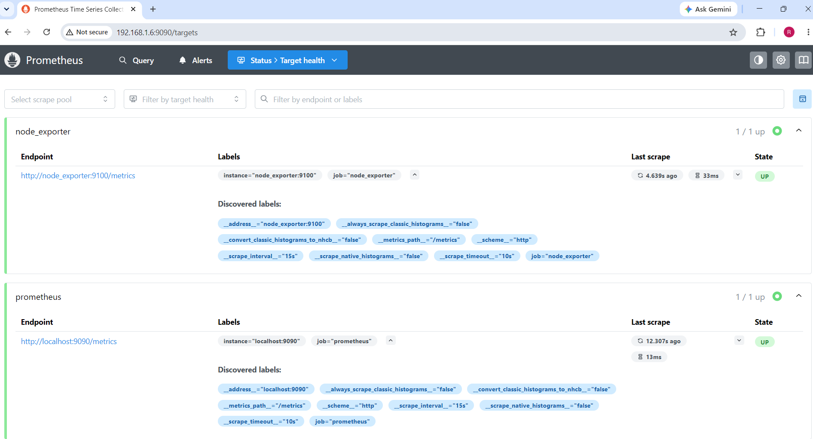

# IT Infrastructure & DevOps Trainee Project

A hands-on DevOps implementation project demonstrating practical skills in **Linux administration**, **Docker containerization**, **Bash automation**, and **monitoring**. This project walks through building a secure, containerized 3-tier web application with automated health checks, backups, and observability.

---

## 📋 Table of Contents

1. [Project Overview](#-project-overview)
2. [Architecture](#-architecture)
3. [Prerequisites](#-prerequisites)
4. [System Security & Linux](#1-system-security--linux)
5. [Docker & Web Services](#2-docker--web-services)
6. [Bash Automation & Cron](#3-bash-automation--cron)
7. [Backups & Monitoring](#4-backups--monitoring)
9. [Tools & Technologies](#-tools--technologies-used)

---

## 🎯 Project Overview

This project demonstrates an end-to-end DevOps workflow on an Ubuntu Server, covering:

| Phase | Focus Area | Key Deliverables |
|-------|-----------|------------------|
| 1 | Linux & Security | Hardened SSH, UFW firewall, dedicated sudo user |
| 2 | Containerization | 3-tier app (Nginx + Flask + PostgreSQL) via Docker Compose |
| 3 | Automation | Health check script scheduled via cron every 15 minutes |
| 4 | Reliability | Database backups, Prometheus monitoring |
| 5 | Lifecycle | Verification steps and clean teardown procedures |

---

## 🏗️ Architecture

```
                    ┌─────────────────────────────────────┐
                    │           Ubuntu Server             │
                    │                                     │
   Client ──────►   │  ┌──────────────────────────────┐   │
   (Port 80)        │  │         Nginx (Proxy)        │   │
                    │  │        Host Port: 80         │   │
                    │  └──────────────┬───────────────┘   │
                    │                 │                   │
                    │                 ▼                   │
                    │  ┌──────────────────────────────┐   │
                    │  │       Flask Backend          │   │
                    │  │     Internal Port: 5000      │   │
                    │  └──────────────┬───────────────┘   │
                    │                 │                   │
                    │                 ▼                   │
                    │  ┌──────────────────────────────┐   │
                    │  │    PostgreSQL Database       │   │
                    │  │  Persistent Volume: pgdata   │   │
                    │  └──────────────────────────────┘   │
                    │                                     │
                    │  ┌──────────────────────────────┐   │
                    │  │  Prometheus (Monitoring)     │   │
                    │  │        Port: 9090            │   │
                    │  └──────────────────────────────┘   │
                    └─────────────────────────────────────┘
```

---

## ✅ Prerequisites

- **Ubuntu Server** (26.04.1 lts used)
- - **Remote OS** (WSL2 ,ubuntu used)
- **Root or sudo access** on the server
- **Docker** and **Docker Compose** installed
- **Git** installed
- Basic knowledge of Linux command line
- SSH key pair (for secure authentication)

### Quick Install (Docker & Docker Compose)

```bash
# Update system
sudo apt update && sudo apt upgrade -y

# Install Docker
sudo apt install -y docker.io docker-compose

# Enable and start Docker
sudo systemctl enable --now docker

# Add current user to docker group (optional, avoids sudo)
sudo usermod -aG docker $USER
newgrp docker

# Verify installation
docker --version
docker compose version
```

---

## 1. System Security & Linux

### 📌 Overview

| Task | Description |
|------|-------------|
| **User Management** | Created a dedicated `trainee` user with `sudo` privileges |
| **SSH Hardening** | Disabled root login, enforced key-based auth, changed port to `2222` |
| **Firewall (UFW)** | Allowed only SSH (2222), HTTP (80), and HTTPS (443) |

### 🖼️ Firewall Status


### ⚙️ Setup Commands

**Step 1 — Create user and grant sudo:**
```bash
sudo adduser trainee
sudo usermod -aG sudo trainee
```

**Step 2 — Set up SSH key authentication for `trainee`:**
```bash
# On local machine
ssh-keygen -y -f ~/.ssh/id_ed25519 > ~/.ssh/id_ed25519.pub
ssh-copy-id -p 22 trainee@<server-ip>
```

**Step 3 — Harden SSH configuration:**
```bash
sudo nano /etc/ssh/sshd_config
```

Modify/add the following directives:
```
Port 2222
PermitRootLogin no
PasswordAuthentication no
PubkeyAuthentication yes
AllowUsers trainee
```

**Step 4 — Validate SSH config and restart service:**
```bash
sudo sshd -t                       # Validate syntax
sudo systemctl restart ssh
sudo systemctl status ssh
```

**Step 5 — Configure UFW firewall:**
```bash
# Set default policies
sudo ufw default deny incoming
sudo ufw default allow outgoing

# Allow required ports
sudo ufw allow 2222/tcp comment 'SSH'
sudo ufw allow 80/tcp   comment 'HTTP'
sudo ufw allow 443/tcp  comment 'HTTPS'

# Enable firewall
sudo ufw enable

# Verify rules
sudo ufw status verbose
```

> ⚠️ **Warning:** Always verify your new SSH port works in a **new terminal** before closing your existing session to avoid lockout.

---

## 2. Docker & Web Services

### 📌 Overview

Deployed a **3-tier architecture** using Docker Compose:

| Tier | Service | Purpose | Port |
|------|---------|---------|------|
| 1 | **Nginx** | Reverse proxy | Host: `80` → Container: `80` |
| 2 | **Flask** | Python backend API | Internal: `5000` |
| 3 | **PostgreSQL** | Database with persistent volume | Internal: `5432` |

### 🖼️ Running Containers


### ⚙️ Setup Commands

**Step 1 — Clone the repository:**
```bash
git clone <your-repo-url>
cd <your-repo-directory>
```

**Step 2 — Build and start containers in detached mode:**
```bash
sudo docker compose up -d --build
```

**Step 3 — Verify containers are running:**
```bash
sudo docker ps
```

Expected output shows three containers: `nginx`, `flask_backend`, `postgres_db`.

**Step 4 — Check logs for any errors:**
```bash
sudo docker compose logs -f
```

**Step 5 — Inspect the Docker network:**
```bash
sudo docker network ls
sudo docker network inspect <project>_default
```

**Step 6 — Check persistent volume for PostgreSQL:**
```bash
sudo docker volume ls
sudo docker volume inspect <project>_pgdata
```

### 🖼️ Application Output



### 🌐 Verify Application Access

**Step 1 — Find server IP:**
```bash
ip a | grep inet
```

**Step 2 — Test with curl:**
```bash
curl -I http://localhost
curl http://192.168.1.6
```

**Step 3 — Open in browser:**
```
http://192.168.1.6
```

Expected output: `Hello from the Flask Backend!`

---

## 3. Bash Automation & Cron

### 📌 Overview

Created an automated health check script: **`/opt/scripts/infra_health_check.sh`**

**What the script does:**
- ✅ Checks **CPU**, **RAM**, and **Root Disk** usage
- ✅ Verifies **Docker daemon** is running
- ✅ Verifies the **`flask_backend`** container is up
- ✅ Triggers a `[WARNING]` if disk > 85% or container is down
- ✅ Logs all output to `/var/log/infra_health.log`
- ✅ Scheduled via **cron** to run every **15 minutes**

### 🖼️ Script Execution & Logs



### ⚙️ Setup Commands

**Step 1 — Create scripts directory:**
```bash
sudo mkdir -p /opt/scripts
```

**Step 2 — Create the health check script:**
```bash
sudo nano /opt/scripts/infra_health_check.sh
```

**Step 3 — Make the script executable:**
```bash
sudo chmod +x /opt/scripts/infra_health_check.sh
```

**Step 4 — Run manually to test:**
```bash
sudo /opt/scripts/infra_health_check.sh
```

**Step 5 — Verify log output:**
```bash
cat /var/log/infra_health.log
tail -f /var/log/infra_health.log     # live tail
```

**Step 6 — Schedule cron job (every 15 minutes):**
```bash
sudo crontab -e
```

Add this line:
```cron
*/15 * * * * /opt/scripts/infra_health_check.sh
```

**Step 7 — Verify cron job is registered:**
```bash
sudo crontab -l
```

> 💡 **Reference:** Use [crontab.guru](https://crontab.guru/) to validate cron expressions.

---

## 4. Backups & Monitoring

### 🗄️ Database Backup

**Script:** `db_backup.sh`

**Behavior:**
- Dumps the PostgreSQL database
- Compresses the dump to `gzip`
- Stores it at with timestamp`/var/backups/db/db_backup_YYYYMMDD.sql.gz`

### 🖼️ Backup Output



### ⚙️ Setup Commands

**Step 1 — Create the backup script:**
```bash
sudo nano db_backup.sh
```

**Step 2 — Make it executable:**
```bash
chmod +x db_backup.sh
```

**Step 3 — Create the backup directory:**
```bash
sudo mkdir -p /var/backups/db
```

**Step 4 — Run the backup manually:**
```bash
sudo ./db_backup.sh
```

**Step 5 — Verify backup file was created:**
```bash
ls -lh /var/backups/db/
```


### ♻️ Restore Command

```bash
gunzip -c /var/backups/db/db_backup_YYYYMMDD.sql.gz \
  | sudo docker exec -i postgres_db psql -U trainee appdb
```


### 📊 Monitoring with Prometheus



### ⚙️ Setup & Verification

**Step 1 — Verify Prometheus is running:**
```bash
sudo docker ps | grep prometheus
```

**Step 2 — Access Prometheus web UI:**
```
http://192.168.1.6:9090
```

**Step 3 — Check target health:**
Navigate to **Status → Targets** in the Prometheus UI.  
All configured scrape targets should show status `UP`.

**Step 4 — Run an example query:**
```promql
up
```
This returns `1` for healthy targets and `0` for down targets.

---

## 5. Verification & Teardown

### ✅ Verification Checklist

| # | Check | Command |
|---|-------|---------|
| 1 | User & sudo privileges | `id trainee && sudo -l -U trainee` |
| 2 | SSH port change | `sudo ss -tlnp \| grep 2222` |
| 3 | Firewall rules | `sudo ufw status verbose` |
| 4 | All containers running | `sudo docker ps` |
| 5 | Application responds | `curl -I http://localhost` |
| 6 | Health check logs | `tail -n 20 /var/log/infra_health.log` |
| 7 | Backup files exist | `ls -lh /var/backups/db/` |
| 8 | Prometheus targets | Open `http://<ip>:9090/targets` |


## 🛠️ Tools & Technologies Used

| Category | Tools |
|----------|-------|
| **OS** | Ubuntu Server 26.04.1 LTS |
| **Containerization** | Docker, Docker Compose |
| **Web Server** | Nginx |
| **Backend** | Python Flask |
| **Database** | PostgreSQL |
| **Monitoring** | Prometheus |
| **Automation** | Bash, Cron |
| **Security** | UFW, SSH hardening |
| **Version Control** | Git |

---

## 🚑 Troubleshooting

| Issue | Likely Cause | Fix |
|-------|-------------|-----|
| Cannot SSH after hardening | Wrong port or key auth not set | Connect via console, revert `sshd_config`, restart SSH |
| `docker compose up` fails | Port 80 already in use | `sudo lsof -i :80` → kill or reconfigure |
| Container keeps restarting | Misconfigured env or DB unreachable | `sudo docker logs <container>` |
| Health check not running | Cron daemon not active | `sudo systemctl status cron` |
| Backup file empty | DB credentials wrong | Verify env vars in `docker-compose.yml` |
| Prometheus target `DOWN` | Wrong scrape config or network | Check `prometheus.yml`, ensure service is reachable |